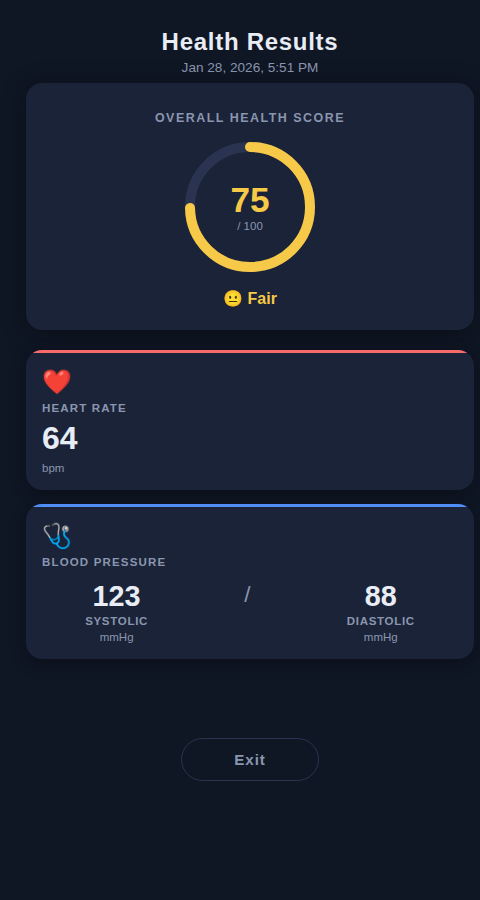

# MMA-Web-Result-Demo

A lightweight, single-page web app that decodes an MMA (Magic Mirror Appliance) health-results payload from the URL query string and displays a clean health dashboard.

---

## Features

- Parses the `?r=` URL parameter — a NuraQR-encoded binary payload (base64 + CRC-16 hashed keys + float-16 values)
- Displays **Health Score**, **Heart Rate**, **Systolic BP**, and **Diastolic BP**
- **Exit** button at the bottom triggers `AndroidBridge.onJSNavigateBack()` for Android WebView integration
- Zero external dependencies — all decoding logic (float-16, CRC-16) is implemented inline

---

## How it works

The `?r=` query parameter contains a URL-safe base64-encoded binary blob with the following structure:

| Bytes | Content |
|-------|---------|
| 0–2   | Magic header `NQ1` (0x4E, 0x51, 0x31) |
| 3–6   | Compact timestamp (Uint32 LE, format: `YYMMDDHHmm`) |
| 7+    | Result payload: repeated 4-byte chunks — 2-byte CRC-16 key + 2-byte float-16 value |

Point IDs (e.g. `HR_BPM`) are hashed to a 2-byte CRC-16 key. Values are stored as IEEE 754 half-precision (float-16) numbers.

---

## Running locally

```bash
# Python
python3 -m http.server 8080

# Node.js
npx http-server -p 8080
```

Then open with the mock data URL:

```
http://localhost:8080/?r=TlEx12gMm7AqvTJcwnJVJmBZVEsYYVRjqT88UYV6VE49QlLKAwBD%2BGr1U0qmw04TZkk909cAUUCwJUM1jKJIHNF2Qpi320FrlapUFb4YRR0OQETYue1Nv6d8UEgs%2FFH4wABMTQoAAKQaeVXxTdBO9s63VyfTVURT6kxZcZJrQ3laAEJgCm1S9JN3U8MillBAzMpDJvMAPPITOk5JCtlHbJ4xQf8MllDYTwBC
```

---

## Screenshot

Mock data decoded values:
- **Health Score:** 75 / 100 — 😐 Fair
- **Heart Rate:** 64 bpm
- **Blood Pressure:** 123 / 88 mmHg



---

## Reference

Decoding logic based on [nuralogix/mma-microsite-demo](https://github.com/nuralogix/mma-microsite-demo).
